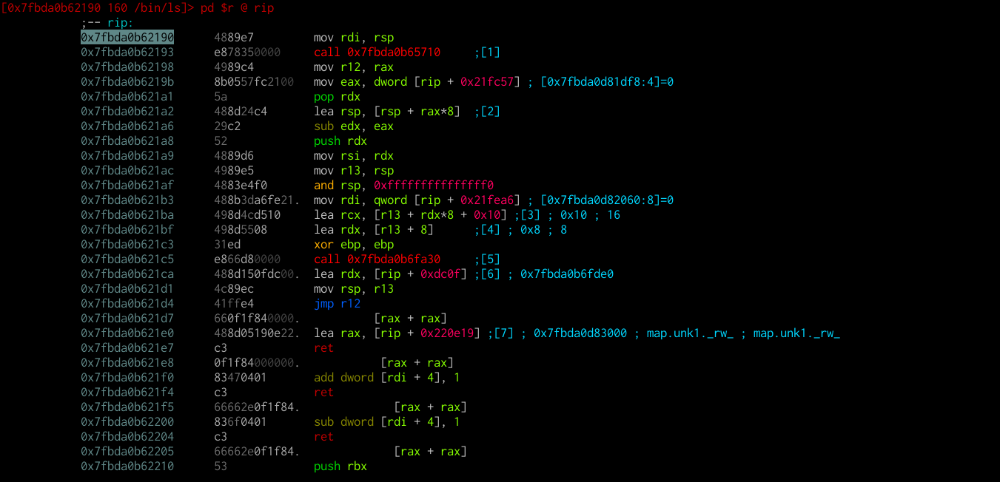
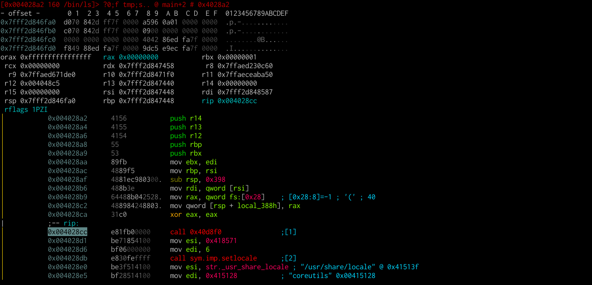

# Visual Debugging

The process of debugging usually requires a lot of visual feedback from the debugger that's being used. Although the radare2 debugger is fairly usable from the command mode, it is fairly uninspiring to do so.

Luckily, debugging can be done directly from visual mode.

As usual, we load `/bin/ls`.

```
r2 -Ad /bin/ls
```

We then switch to visual mode, disassembly view.



The first question that pops in your mind probably is... where am I?! Let's find out!

We can print a list of memory maps of the current process via `dm`.

> **Reminder**: you don't have to quit visual mode to input commands. Simply use `:` and then enter the command as you would in command mode. In our case, `:dm<Enter>`

```
:> dm
sys 112K 0x0000000000400000 - 0x000000000041c000 s -r-x /bin/ls /bin/ls
sys   8K 0x000000000061b000 - 0x000000000061d000 s -rw- /bin/ls /bin/ls
sys   4K 0x000000000061d000 - 0x000000000061e000 s -rw- unk0 unk0
sys 128K 0x00007fbda0b61000 * 0x00007fbda0b81000 s -r-x /lib/x86_64-linux-gnu/ld-2.19.so /lib/x86_64-linux-gnu/ld-2.19.so
sys   8K 0x00007fbda0d81000 - 0x00007fbda0d83000 s -rw- /lib/x86_64-linux-gnu/ld-2.19.so /lib/x86_64-linux-gnu/ld-2.19.so
sys   4K 0x00007fbda0d83000 - 0x00007fbda0d84000 s -rw- unk1 unk1
sys 132K 0x00007ffdb16fc000 - 0x00007ffdb171d000 s -rw- [stack] [stack]
sys   8K 0x00007ffdb17a6000 - 0x00007ffdb17a8000 s -r-x [vdso] [vdso]
sys   8K 0x00007ffdb17a8000 - 0x00007ffdb17aa000 s -r-- [vvar] [vvar]
sys   4K 0xffffffffff600000 - 0xffffffffff601000 s -r-x [vsyscall] [vsyscall]
:> 
```

An asterisk(`*`) will indicate where the current seek is located.

> **Note**: This may be unintuitive at first, but the current seek is independent from the program counter (RIP, in our case). You can change the seek freely. `dm` will always tell you where the seek is, not where RIP is pointing at.

We can safely say that we are in the loader's code. This information can be accessed easier via `dm.`, which only tells us `/lib/x86_64-linux-gnu/ld-2.19.so`.

We can skip the painful steps the loader has to make, first by changing the seek to `main` (`o` and type `main`), setting a breakpoint (`b` or `<F2>`) and continuing (`<F9>`).



We can change the print mode to show the stack and registers along with the disassembly view (an extra `p` from the normal disassembly view). Stepping into (`s`) or stepping over (`S`) will update `rip`, the registers and the stack. Registers will get colored if they are changed after an instruction.

You can still access all the debugger commands through the command menu (`:`) and also have visual feedback. You can seek and investigate functions, set breakpoints and so on. To return the seek to the program counter at any time, press `.`.
