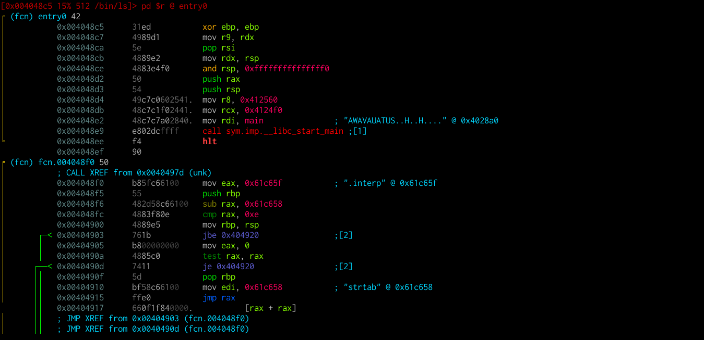

# Visual Navigation

As usual, we start with our `ls` binary.

```
$ r2 -A /bin/ls
 [0x004048c5]> 
```

We can enter visual mode with the command `V`.


You will be presented with a hex view of the binary. You can cycle between view modes using `p` and `P`. You can identify each mode by reading the prompt, which shows you which command is being run to generate the output.

```
[0x004048c5 15% 512 /bin/ls]> x @ entry0             # Hex mode
[0x004048c5 15% 512 /bin/ls]> pd $r @ entry0         # Disassembly mode
[0x004048c5 15% 160 /bin/ls]> ?0;f tmp;s.. @ entry0  # Hex|Registers|Disassembly
[0x004048c5 15% 512 /bin/ls]> pxw @ entry0           # Hex words
[0x004048c5 15% 160 /bin/ls]> pc @ entry0            # C buffers
[0x004048c5 15% 4096 /bin/ls]> pxA @ entry0          # Operation analysis
[0x004048c5 15% 512 /bin/ls]> pxa @ entry0           # Annotated hexdump
```

For now, we are going to focus on the disassembly view (by pressing `p` once).



## Getting help

As always, you can press `?` to view available shortcuts in this mode. For now, we will focus on navigation; there are a few shortcuts which are not so obvious.

## Basic movement

You can move up or down (instruction by instruction) via the arrow keys or `j` (down) and `k` (up), similar to Vim. Move up or down over entire functions via `n` and `N`.

When the current instruction is a `jmp` or a `call`, you can follow it by pressing `<Enter>`. But there's a faster way. Notice that the `call sym.imp.__libc_start_main` instruction has a comment with the number `1` between square brackets. If you press `1`, even if you are not currently positioned on the call instruction, you will follow that call. The same goes for the `jmp` instruction further down, with `2` commented in square brackets.

You can go to any offset with `o`. You can undo any seek at any time via the `u` key and redo it with `U`.

## Marks

You can set marks at any point using `m` followed by any key (case-sensitive). To go to a mark, press `'` followed by the mark key. Be aware that marks are not highlighted in any way in contrast to flags.

## Fuzzy flag searcher

A fuzzy-like searcher can be accessed with the `_` key, very handy for quickly finding and switching between functions, strings and other flags.

## Cross-references

You can get a list of cross-references (xrefs, for short) from/to data using `x` and `X`, respectively.

For example, pressing `X` in main will yield


Again, using the numbers `1-9`, you can quickly go to any of these references.
